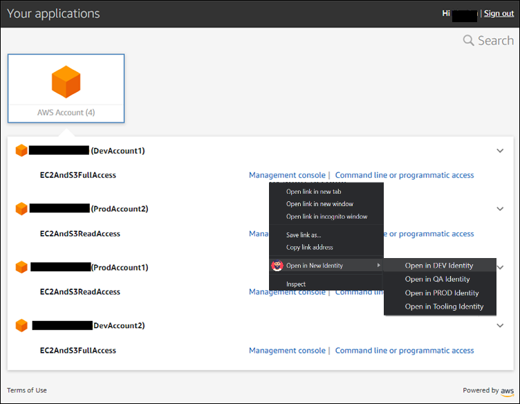
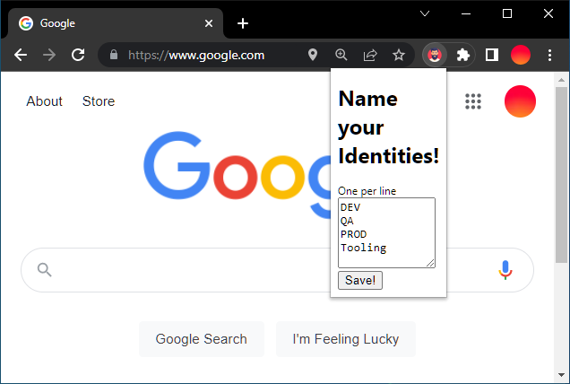

## Update 17 Dec 2022
 * I am abandoning this project mainly due to upcoming Manifest v3 changes in 2023   
 * I have switch to firefox with Multi-Account Containers for my SSO enabled work account   
 * Another option which looks very promising, but might not play well with git-bash is https://github.com/common-fate/granted

## What is this?

A Google Chrome plugin project, inspired from [Firefox Multi-Account Containers](https://addons.mozilla.org/en-US/firefox/addon/multi-account-containers/), lets you keep parts of your online life separated into identity tabs.   
Cookies are separated by "identities", allowing you to use the web with multiple accounts.

I use it to login to multiple different AWS account at the same time without having to switch browser.

## How it works

Under the hood, it separates website storage into tab-specific Identities. Cookies downloaded by one Identity are not available to other Identities. With this extension, you can...

* Sign in to two different accounts on the same site (for example, you could sign in to work email and home email in two different Identity tabs.
* Avoid leaving social-network footprints all over the web (for example, you could use an Identity tab for signing in to a social network, and use a different tab for visiting online news sites, keeping your social identity separate from tracking scripts on news sites)
* After installing the extension, click the extension icon to edit your Identities.

## Loading the extension

1. Checkout this project in a location on your computer
2. Open the Extension Management page by navigating to chrome://extensions, or you can also open it from the Extensions menu in the settings.
3. Once there, enable the Developer mode and use the Load unpacked button to select your extension directory.

Behold thy extension! 

## Credits

* Idea inspired by Firefox Multi-Account Containers
* User Icon from [Freepix](https://www.flaticon.com/free-icon/man_2202112)
* Source: Reading and debugging source-code of various other extensions

### Usage

* Personally using Only for AWS Single-signon, Use at your own risk.

### Manifest v3 support (ToDD)

Chrome developers at Google began working on Manifest v3 almost four years ago.  
Harsh criticism of the idea and its implementation followed in early 2019, especially from the developers of ad blockers and the like. 

#### Filter API limitations
The main change to be implemented with the introduction of Manifest v3 are restrictions on the Web Request API.     
Extensions should only be able to read browser requests, but not block, modify or redirect them.   
As an alternative, the Declarative Net Request API (DNR) will be introduced.

